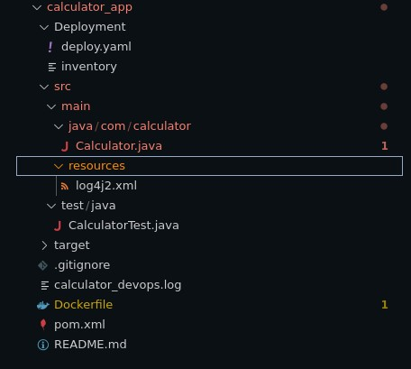

<p style="text-align:center; font-size: 50px;">
<strong>SPE Assiginment 1 Report</strong>
</p>

<p style="text-align:center; font-size: 30px;">
Name: Krutik Patel IMT2021024<br>
</p>

## Github Link: [Krutik-Patel/Calculator-CI-CD](https://github.com/Krutik-Patel/Calculator-CI-CD)

## DockerHub Link: [krutikpatel/calculator/](https://hub.docker.com/repository/docker/krutikpatel/calculator/general)
  


## **Project Overview**

  

This project demonstrates the integration of DevOps tools and workflows in developing, deploying, and monitoring a simple calculator application. The primary focus is on establishing a complete DevOps pipeline.
  

---

  ## **What and Why of DevOps?**
## What is DevOps?

  DevOps encompasses a collection of methodologies that merge software development (Dev) with IT operations (Ops). Its primary goal is to reduce the development cycle time and consistently deliver high-quality software. DevOps incorporates automation, continuous integration, and continuous delivery into the development process. It fosters collaboration among developers, operations teams, and other stakeholders. Essential elements of DevOps include workflow automation, infrastructure as code, version control, and monitoring systems.


## Why DevOps?


Enhanced Collaboration: DevOps fosters better communication and efficiency by bridging the gap between development and operations teams. Faster Delivery: By leveraging automation and continuous integration, the software development lifecycle is accelerated, allowing for quicker deployment to production. Increased Reliability: Automated testing and monitoring contribute to fewer errors and greater stability in production environments. Scalability: DevOps enables easy management of infrastructure changes and software updates in large-scale systems with minimal manual intervention. Improved Quality: Continuous feedback loops help detect issues earlier in the process, thereby enhancing software quality. Cost Efficiency: Automation minimizes manual processes, saving time and resources, and ultimately reducing operational costs.


--- 

## **Objectives**

  

1. Set up a local development environment within an IDE.

2. Implement version control for effective tracking and collaboration.

3. Push the project to a remote Git repository.

4. Design and implement a CI/CD pipeline for automatic builds and tests on code updates.

5. Containerize the application and push it to a remote container registry.

6. Deploy the container using Jenkins for a streamlined and automated process.

  

---

  

## **Tools & Technologies**

  

- **Code Editor**: [VS Code](https://code.visualstudio.com/)

- **Version Control**: Git and GitHub

- **Build Tool**: Apache Maven

- **CI/CD**: Jenkins

- **Containerization**: Docker

- **Configuration Management**: Ansible

- **Build Automation**: Ngrok, GitHub Webhooks

  

---

  

## **Workflow**

  

1. **Development**: Using VS Code for coding and project management.

2. **Version Control**: Code is managed with Git, hosted on GitHub.

3. **Build**: Maven is used to compile and package the project.

4. **CI/CD**: Jenkins automates the process of testing and deployment.

5. **Containerization**: Docker is employed to ensure consistent deployments across environments.

6. **Configuration Management**: Ansible automates infrastructure setup and deployment.

7. **Build Automation**: Ngrok facilitates GitHub webhooks for triggering Jenkins builds.

  

---

  

## **Installation and Setup**

  

1. **Java**: Install with:

```bash
   sudo apt install default-jre
   sudo apt install default-jdk
```

   Verify with `java --version` and `javac --version`.

  

2. **VS Code**: Download from [VS Code](https://code.visualstudio.com/).

  

3. **Git**: Install using:

```bash
   sudo apt install git
```

   Verify with `git --version`.

  

4. **Maven**: Install using:

```bash
   sudo apt install maven
```

   Verify with `mvn --version`.

  

5. **Jenkins**: Install with:

```bash
   brew install jenkins
```

   Start Jenkins with `brew services start jenkins`.

  

6. **Docker**: Install Docker Desktop from [here](https://www.docker.com/products/docker-desktop), verify with `docker --version`.

  

7. **Ansible**: Install via:

```bash
   brew install ansible
```

   Verify with `ansible --version`.

  

8. **Ngrok**: Download from the official [Ngrok site](https://ngrok.com/) by signing up for free account and follow the installation steps, and set it up with:

```bash
   ngrok config add-authtoken <your_authtoken>
```

  

---

  

## **Project Implementation**

  

To start, create a new project in VS Code:

  

1. Open the command palette (`Ctrl + Shift + P`).

2. Select `Java: Create new project`.

3. Choose **Maven** as the build tool and select `maven-archetype-quickstart`.

4. Enter a project name, e.g., `com.calculator`, and choose your project folder.

5. Complete the java code and write tests for the calculator program. JUnit is used for testing in this project. You can refer to the github repo of the project [link](https://github.com/Krutik-Patel/Calculator-CI-CD).

  


  

### **Git Workflow**

  

Initialize a Git repository and push the project to GitHub using the following commands:

  

```bash
git init
git add .
git commit -m "Initial commit"
git remote add origin <repository-url>
git push -u origin main
```

  

---

  

## **Project Structure**

  

| Directory/File                                                | Usage                                      |
| ------------------------------------------------------------- | ------------------------------------------ |
| `calculator_app`                                              | Main directory                             |
| `calculator_app/Deployment`                                   | Files for Ansible deployment               |
| `calculator_app/src`                                          | Java code for the calculator app and tests |
| `calculator_app/src/main/java/com/calculator`                 | Calculator app's main code directory       |
| `calculator_app/src/main/java/com/calculator/Calculator.java` | Calculator app's main code                 |
| `calculator_app/src/resources`                                | Configuration files (e.g., `log4j2.xml`)   |
| `calculator_app/src/test/java`                                | Test file directory                        |
| `calculator_app/src/test/java/CalculatorTest.java`            | Test file for Calculator app               |
| `calculator_app/.gitignore`                                   | Files/Directories to ignore for Git        |
| `calculator_app/calculator_devops.log`                        | Log file                                   |
| `calculator_app/Dockerfile`                                   | Docker configuration                       |
| `calculator_app/pom.xml`                                      | Maven configuration                        |
| `calculator_app/target`                                       | Stores built JAR and class files           |

  



  

---

  

## **Building and Running the Project**

  

### **pom.xml Configuration**

  Setup your pom.xml file like shown below.


  

Run the following commands to clean, compile, and install the project:

  

```bash
mvn clean     # Cleans built files
mvn compile   # Compiles the project
mvn install   # Creates the JAR file
```

  `mvn clean`:Removes the 'target' folder, ensuring a fresh start for the subsequent compilation. This step eliminates any previous build artifacts.
  `mvn compile`: Compiles the project and its associated test cases. This phase ensures the code is error-free and ready for the subsequent steps.
  `mvn install`: Generates the JAR file. This final step packages the project, creating the desired output artifact (JAR file) once the compilation is successful.

Alternatively, run:

  

```bash
mvn clean install
```

  

This will clean, compile, and install in one step.

  

### **Running the JAR File**

  

Use the following command to run the JAR:

  

```bash
java -jar <filename>.jar
```

  

---

  

## **Logging and Testing**

  

For logging, first configure your log4j2.xml file:

  


Then use Log4j with the following import statements in the main Calculator java file. Consequently update your pom.xml file to include the dependencies. Sample `pom.xml` file is provided in the repo.


```java
import org.apache.logging.log4j.LogManager;
import org.apache.logging.log4j.Logger;
```

The specified logging format includes the following components:

- `%d{yyyy-MM-dd HH:mm:ss.SSS}`: Represents the timestamp with millisecond precision.
- `%t`: Indicates the running thread's name.
- `%-5level`: Denotes the log level with left alignment and a maximum width of 5 characters.
- `%logger{36}`: Refers to the logger's name within a maximum of 36 characters.
- `%msg`: Represents the user-written message contained in the source code.


Run the following command to execute tests and build the JAR:


```bash
mvn clean install
```


  

---

  

## **Jenkins Pipeline**

  

To set up Jenkins, go to `http://localhost:8080` and install the necessary plugins.

  


  

Here's the Jenkins pipeline script that is used in the project:

  

```groovy
pipeline {
    environment {
        docker_image = ""
    }
    agent any
    tools {
        maven 'Maven 3.9.6'
    }
    stages {
        stage('Git Clone') {
            steps {
                git branch: 'main', url: 'https://github.com/Krutik-Patel/Calculator-CI-CD.git'
            }
        }
        stage('Maven Build') {
            steps {
                sh 'mvn clean install'
            }
        }
        stage('Build Docker Image') {
            steps {
                script {
                    docker_image = docker.build "krutikpatel/calculator:latest"
                }
            }
        }
        stage('Push Docker Image to Hub') {
            steps {
                script {
                    docker.withRegistry('', 'DockerHubCred') {
                        docker_image.push()
                    }
                }
            }
        }
        stage('Clean Docker Images') {
            steps {
                script {
                    sh 'docker container prune -f'
                    sh 'docker image prune -f'
                }
            }
        }
        stage('Ansible Deployment') {
            steps {
                ansiblePlaybook inventory: 'Deployment/inventory', playbook: 'Deployment/deploy.yml'
            }
        }
    }
}
```

  ### Pipeline Stages Summary

1. **Git Clone**: Clones the Git repository from the master branch using the URL `https://github.com/Krutik-Patel/Calculator-CI-CD.git`.
   
2. **Maven Build**: Builds the project using Maven with the command `mvn clean install` to clean and compile the code.

3. **Build Docker Image**: Builds a Docker image for the application using `docker.build`, tagging it as `krutikpatel/calculator:latest`.

4. **Push Docker Image to Hub**: Authenticates with Docker Hub and pushes the Docker image using `docker.withRegistry` with the credentials `DockerHubCred`.

5. **Clean Docker Images**: Removes unused containers and images using `docker container prune -f` and `docker image prune -f` to free up space.

6. **Ansible Deployment**: Deploys the application using the `ansiblePlaybook` step to run the Ansible playbook `deploy.yaml`, with additional options like colorized output and disabling host key checking.

---

  

## **Docker Integration**

  

Use the following `Dockerfile`, to facilitate building of docker image in the pipeline script.

  

```Dockerfile
FROM openjdk:17
COPY ./target/calculator_app-1.0-SNAPSHOT-jar-with-dependencies.jar ./
WORKDIR ./
CMD ["java", "-jar", "calculator_app-1.0-SNAPSHOT-jar-with-dependencies.jar"]
```

  


  

You can verify that the Docker image is running using:

  

```bash
sudo docker images
```

  

---

  

## **Pushing to DockerHub**

  

Stage 4 focuses on pushing the image to docker hub. In the subsequent steps, ansible will pull from dockerhub. To achieve this, set up a credential in Jenkins, containing the Jenkins username and password for authentication.
  


  

---

  

## **Freeing Up Resources**

  

Clean up unused Docker containers and images with the following commands. Also add this to the pipeline script.

  

```bash
docker container prune -f
docker image prune -f
```

  

---

  

## **Pulling and Running Docker Containers with Ansible**

  

Create two files, `inventory` and `deploy.yml`, in the `Deployment` folder:

  

- **Inventory file**:

  

```ini
localhost ansible_connection=local ansible_user=krutik
```

  

- **Deploy.yml**:

  

```yaml
---
- name: Pull Docker Image of Calculator
  hosts: localhost
  tasks:
    - name: Pull Docker image
      docker_image:
        name: krutikpatel/calculator:latest
        source: pull
    - name: Start Docker service
      service:
        name: docker
        state: started
    - name: Run container
      shell: docker run -it -d --name Calculator krutikpatel/calculator
```

  

Run the following command to view the list of images:

  

```bash
docker images
```

Run the following command to create a container from the image using the first command given below. To view the containers run the second command and to execute the container, run the last command; 

  ```
  docker run -it -d --name Calculator krutikpatel/calculator:latest
  docker ps
  docker start -a -i Calculator
  ```
  
  
  

---

  

## **Automating Pipeline Execution with Ngrok**

 

Use Ngrok to expose Jenkins locally:

  

```bash
ngrok http 8080
```

  
  This will establish an HTTP tunnel using Ngrok. Copy the forwarding URL provided by Ngrok and create a GitHub webhook, using this URL as the payload URL for the webhook configuration. GitHub will initiate a test connection, and a '200 OK' message will confirm the proper setup. Next, update the Jenkins URL to the forwarding URL obtained from Ngrok and configure a build trigger for Git SCM polling. This setup ensures that the pipeline automatically initiates the build process whenever Jenkins detects a new push to the associated GitHub repository. 

  


  

You can verify the setup by pushing some code to the GitHub repository. In the given images below verify using the build times that the build starts once the changes are pushed in the repo and the build starts automatically.


  
  
  
  

---
## **Conclusion**


The Simple Calculator project successfully demonstrates the integration of DevOps tools and workflows. The project was containerized using Docker and deployed using Jenkins and Ansible. GitHub was used for version control, and the build process was automated with Jenkins pipelines.

---
